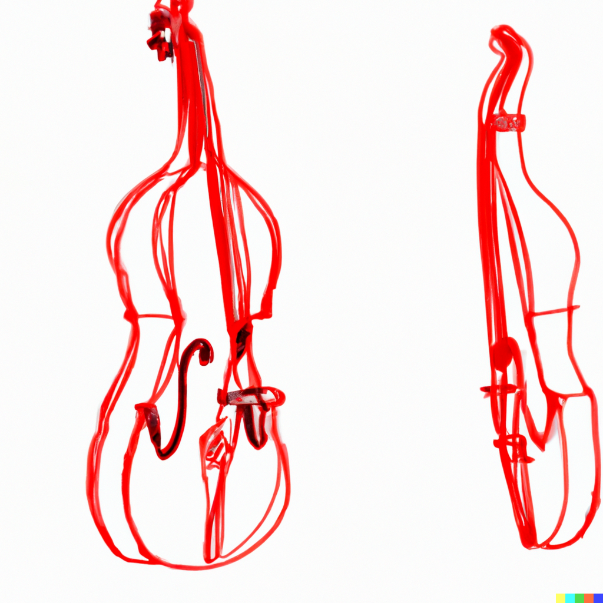

# Double Bass Fingering Ruby Gem

The Double Bass Fingering Ruby Gem is a tool designed for bassists who want to maximize the efficiency of their fingering positions when playing the double bass. This gem provides automatic calculation of the best fingering positions based on a given set of notes.



## Features

* Automatic calculation of the most efficient fingering positions based on a list of notes.

Remember that this is just an algorithm, so maybe is not the fingering that’s reliable and that sounds good 🥲 take into account your knowledge, intuition and hearing to apply the appropriate changes for the obtained results.

## Algorithm

### Rules

For calculating the most efficient fingering positions based on a list of notes, we should take into consideration the rules explained in this amazing [video from the Double Bass HQ Youtube Channel](https://www.youtube.com/watch?v=Vk1fOs_OQd8)

* **Rule 1**: Play at least two notes per position
* **Rule 2**: Never cross strings for a half-step
* **Rule 3**: Play across the strings for technical passages
* **Rule 4**: Shift on one string for melodic passages
* **Rule 5**: Don't cross strings with the same finger
* **Rule 6**: Don't play open strings in lyrical passages 
* **Rule 7**: Shift up in pitch with lower numbered fingers
* **Rule 8**: Shift down in pitch with higher numbered fingers
* **Rule 9**: Group notes together rhythmically
* **Rule 10**: Avoid crossing two or more strings

Not all the rules will be taken into consideration for this algorithm, and at some point, the algorithm will break these rules if a more efficient path is found.

### Calculation steps

This tool applies the following algorithm for calculating the most efficient fingering positions based on a list of notes.

1. Using the first note provided, identify all the possible positions for playing that note around all the fingerboard.
2. For all those possible positions, get the distance to the next note taking into account all the possible positions for playing that note around all the fingerboard.
3. Evaluate all the possible transitions against the algorithm rules and choose the most efficient one based on those rules.
4. Repeat the process for the next transitions.
5. When all the notes have been evaluated, check all the possible paths and return the most efficient one taking into account the algorithm rules.

## Installation

The Double Bass Fingering Ruby Gem can be installed via RubyGems:

```sh
gem install bass-auto-fingering
```

## Usage

To use the Double Bass Fingering Ruby Gem, simply require it in your Ruby code:

```ruby
require 'bass-auto-fingering'
```

Then, create an instance of the `AutoFingering::DoubleBass` class and perform the `fingering_for` method passing the array of notes you need to play:

```ruby
double_bass = AutoFingering::DoubleBass.new
result = double_bass.fingering_for(%w"C2 D2 E2 F2 G2 A2 B2 C3")
```

The `fingering_for` method returns an instance of `AutoFingering::Result` class. 

### Understanding the result

The returned `AutoFingering::Result` instance offers multiple methods for understanding the calculated fingering.

The `full` method returns an array of objects with all the needed information for understanding the calculated fingering. It includes the following properties:

* **note**: The note you need to perform.
* **string**: The string where the note should be performed.
* **position**: The position of the left hand on the double bass.
* **finger**: The finger you need to use. A 0 value indicates an open string, and a positive integer indicates the finger position.

```ruby
result.full # => [
#  { note: "C2", string: "A", position: "first", finger: 2 },
#  { note: "D2", string: "D", position: "open", finger: 0 }
#  { note: "E2", string: "D", position: "first", finger: 1 }
#  { note: "F2", string: "D", position: "first", finger: 2 }
#  { note: "G2", string: "G", position: "open", finger: 0 }
#  { note: "A2", string: "G", position: "first", finger: 1 }
#  { note: "B2", string: "G", position: "second", finger: 2 }
#  { note: "C3", string: "G", position: "second", finger: 4 }
# ]
```

Sometimes you just want to see in a quick way the fingers that you will need to use for the provided notes. The `fingering` method returns just an array of integers representing the finger positions for each note. 

```ruby
result.fingering # => [2, 0, 1, 2, 0, 1, 2, 4]
```

Apart of that, the `AutoFingering::Result` instance offers methods for understand in a better way the calculated fingering:

```ruby
result.initial_position # => "first"
result.initial_string # => "A"
result.total_positions # => 2
result.total_string_changes # => 3
```

## Contributing

Contributions are welcome! If you would like to contribute to the Double Bass Fingering Ruby Gem, please fork this repository and submit a pull request.

## License

The Double Bass Fingering Ruby Gem is released under the Apache 2.0 License.
